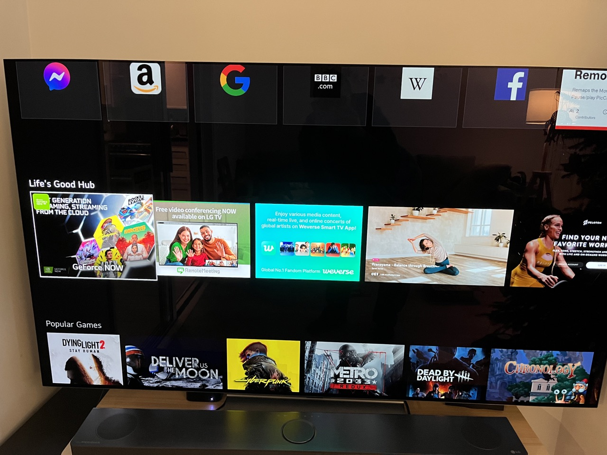
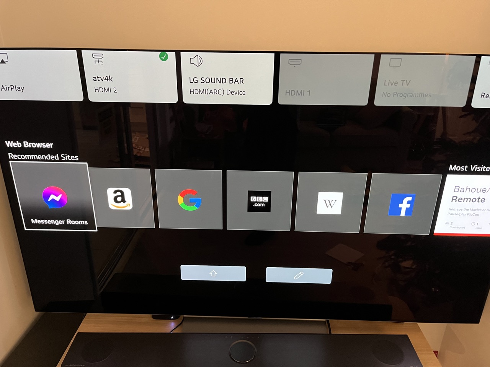
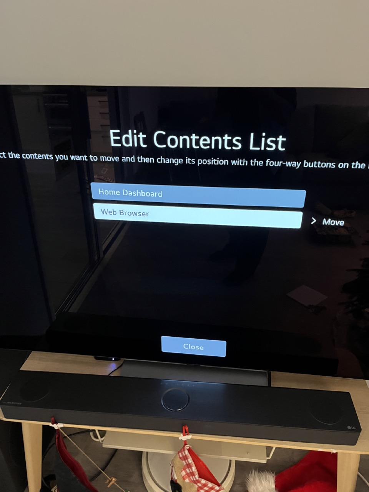

# Remove ads from LG WebOs home screen
Tested on OLED65C24LA
    
    fw: 03.21.30


# Supported versions

1. webos7 (22)

# **WARNING!** 

This script is provided with no warranty, use at your own risk. 
I have done the best I can to ensure the changes are safe and that they are not permanent.
To neutralize this script, simply remove `/var/lib/webosbrew/init.d/ad_killer` file from your TV and reboot it.

## Installation
1. You must root your TV and have webosbrew installed
2. SSH to your TV
3. Execute following commands
```
curl -o /var/lib/webosbrew/init.d/ad_killer https://raw.githubusercontent.com/nurikk/lg-webos-ad-killer/master/ad_killer
chmod +x /var/lib/webosbrew/init.d/ad_killer
/var/lib/webosbrew/init.d/ad_killer
```


## Results

# Before


# After



