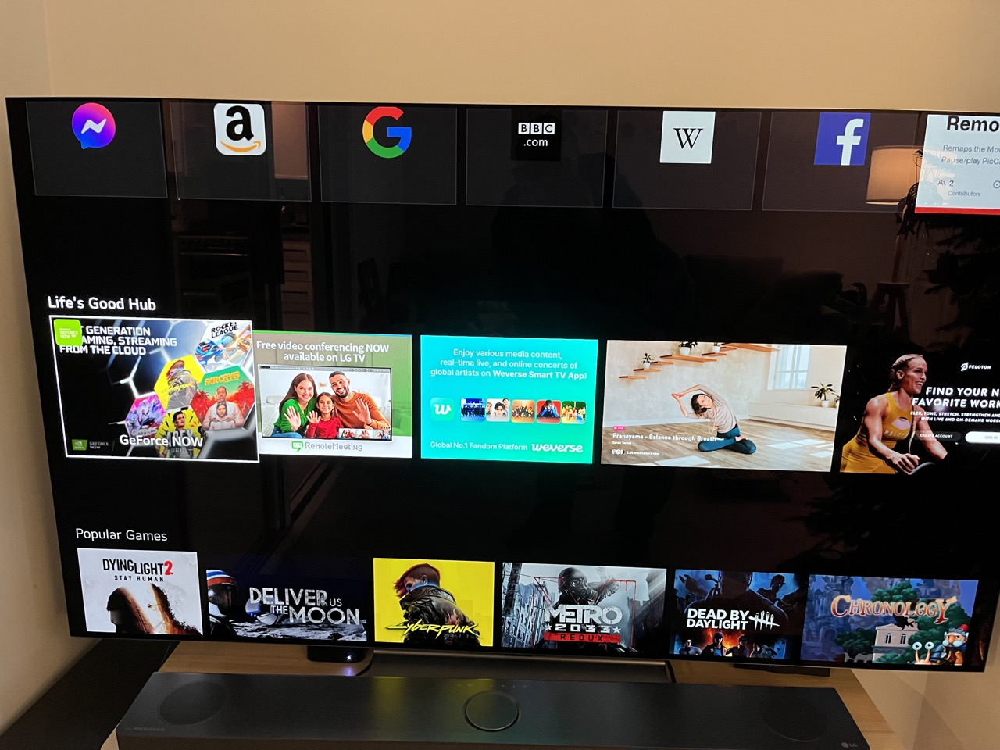
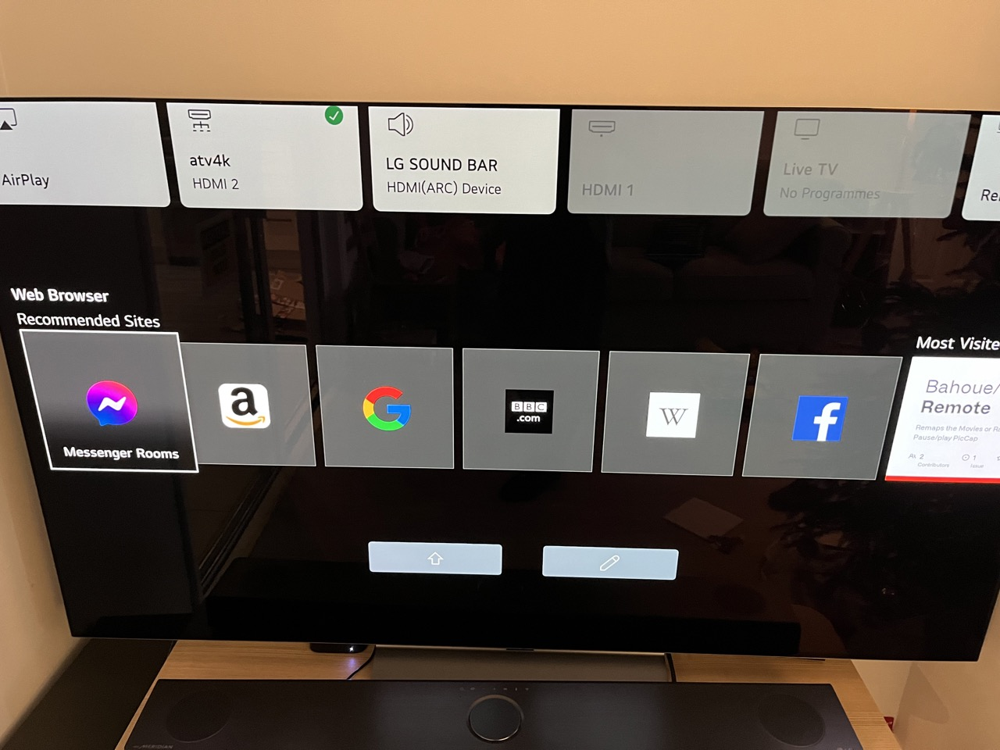
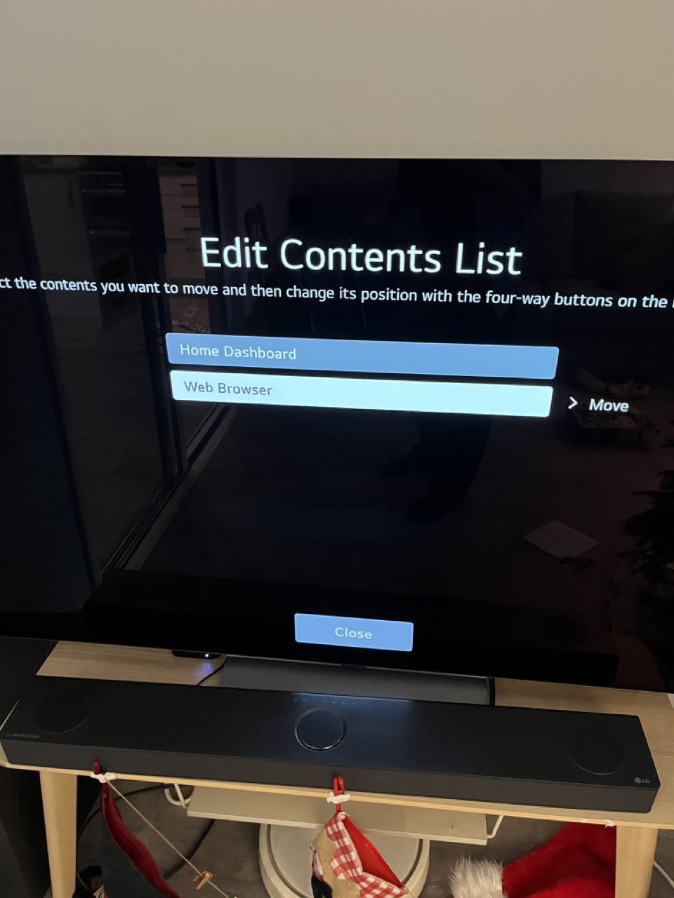

# Remove ads and privacy bloat from LG webOS

Tested on **OLED65C24LA**, webOS 7.4 / webOS TV 22.

The script applies reversible runtime changes at boot through webOS Homebrew Channel:

- removes known promotional Home shelves while preserving unknown future shelves;
- disables LG advertising, automatic content recognition, recommendations, sports prompts and telemetry uploaders;
- in the default `privacy` profile, also disables voice/NLP, music recognition, Alexa, ThinQ and LG IoT integrations;
- bind-mounts a harmless exit stub over selected launchers so Luna cannot immediately respawn them.

It does **not** overwrite or delete system applications. `sdx` is restarted once to reload the filtered Home configuration, but is not disabled. The core Home process is retained unless `--refresh-home` is explicitly requested.

## Profiles

| Profile | Disabled functionality |
|---|---|
| `privacy` (default) | Ads/ACR/telemetry, recommendations, sports alerts, voice input/NLP, music recognition, Alexa, ThinQ, IoT and MQTT integrations |
| `ads` | Ads/ACR/telemetry, recommendations and sports alerts only |

The default profile is intended for TVs where Alexa, ThinQ, IoT and voice features are not used.

## Installation

The TV must be rooted and have webOS Homebrew Channel installed.

```sh
curl -o /var/lib/webosbrew/init.d/ad_killer \
  https://raw.githubusercontent.com/nurikk/lg-webos-ad-killer/master/ad_killer
chmod +x /var/lib/webosbrew/init.d/ad_killer
/var/lib/webosbrew/init.d/ad_killer
```

Useful commands:

```sh
# Validate and report intended changes without applying them
/var/lib/webosbrew/init.d/ad_killer --dry-run

# Use the smaller ads/telemetry profile
/var/lib/webosbrew/init.d/ad_killer --profile ads

# Apply and immediately refresh the Home UI
/var/lib/webosbrew/init.d/ad_killer --refresh-home

# Immediately roll back and persistently disable the boot hook
/var/lib/webosbrew/init.d/ad_killer --disable

# Remove the disable marker and apply again
/var/lib/webosbrew/init.d/ad_killer --enable
```

All runtime mounts disappear on reboot. The persistent disable marker is `/var/lib/webosbrew/ad-killer.disabled`.

## Results

### Before



### After



